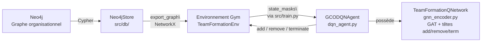

# 🎯 GCO-DQN — Formation d'équipes optimales par Deep Reinforcement Learning

> **Implémentation d'un PoC académique** basé sur Lv et al. (2024), *"Team formation in large organizations: A deep reinforcement learning approach"*, Decision Support Systems, 187, 114343.

Un agent **Double DQN** couplé à un **Graph Attention Network** sélectionne itérativement des employés pour former une équipe qui :
1. **Couvre 100% des compétences** requises par un projet
2. **Minimise la perturbation** des départements d'origine
3. **Réduit la taille** de l'équipe au strict nécessaire

Le tout est persistant dans **Neo4j**, dockerisé, et validé par un protocole scientifique en 5 niveaux.

---

## 📖 Table des matières

- [Contexte & Problématique](#-contexte--problématique)
- [Architecture](#-architecture)
- [Stack technique](#-stack-technique)
- [Démarrage rapide](#-démarrage-rapide)
- [Structure du projet](#-structure-du-projet)
- [Configuration](#-configuration)
- [Utilisation](#-utilisation)
- [Modélisation mathématique](#-modélisation-mathématique)
- [Résultats](#-résultats)
- [Validation scientifique](#-validation-scientifique)
- [Roadmap](#-roadmap)
- [Références](#-références)

---

## 🎯 Contexte & Problématique

### Le problème métier

Dans les grandes organisations **aplaties** et **pilotées par projets**, la formation rapide
d'équipes temporaires est un enjeu critique de la gestion des ressources humaines.

**Question centrale** : comment sélectionner les bons employés pour un projet, en couvrant les
compétences requises, **tout en minimisant la perturbation** des départements d'origine ?

### Pourquoi c'est difficile

| Difficulté | Description |
|-----------|-------------|
| **Combinatoire** | Choisir k employés parmi n → NP-hard (Set Cover) |
| **Multi-objectifs** | Couvrir les skills ≠ minimiser la perturbation |
| **Contraintes** | Niveaux hiérarchiques, disponibilité, budget |
| **Dynamique** | Les organisations évoluent (turnover, projets) |
| **Échelle** | 10⁴ à 10⁶ employés dans une grande entreprise |

### Notre approche

**GCO-DQN** (Graph Combinatorial Optimization - Deep Q-Network) combine :
- **Graph Neural Network (GAT)** : embeddings des employés à partir de leurs compétences,
  niveau et patterns de communication
- **Double DQN** : agent qui apprend à sélectionner/retirer des employés
- **Construction incrémentale** : l'agent peut **ajouter ET retirer**, révisant ses décisions
  passées (cœur de la contribution de l'article)

---

## 🏗 Architecture



**Flux de données (une boucle d'épisode)** :

1. `Neo4jStore.export_graph()` → `nx.Graph` (NetworkX)
2. `TeamFormationEnv(graph, project_skills, all_skills)` — l'env pré-calcule les
   features statiques (`[N, S+2]`), `edge_index` et `project_skill_mask()`
3. `agent.set_graph(features, edges, skill_matrix, project_mask)` — graphe statique
   transféré **une seule fois** sur le device
4. Boucle : `state_masks(env)` → `(mask, cov)` → `agent.select_action(mask, cov,
   valid_actions)` → `env.step(action)` → `agent.store_transition(..., next_valid)` →
   `agent.train_step()` (4× par pas d'env, `grad_steps_per_env_step`)

**Composants clés** :
- `src/db/neo4j_store.py` : persistance Neo4j (schéma, chargement, requêtes Cypher)
- `src/environment/team_formation_env.py` : env Gym, actions add/remove/terminate (2N+1)
- `src/graph/metrics.py` : `DisruptionTracker` incrémental O(deg) + `skill_coverage`
- `src/graph/org_graph.py` : baselines (greedy, random, centralité) + `evaluate_team`
- `src/models/gnn_encoder.py` : `EmployeeGNNEncoder` (GAT) + `TeamFormationQNetwork`
  (têtes add / remove / terminate → sortie 2N+1)
- `src/models/dqn_agent.py` : `GCODQNAgent` — buffer compact, Double DQN, masquage TD
- `src/train.py` : pipeline complet (génération → Neo4j → entraînement → baselines → plots)

---

## 🛠️ Stack technique

| Catégorie | Outil | Version / Notes |
|-----------|-------|-----------------|
| Langage | Python | 3.12 |
| Deep Learning | PyTorch | 2.14.0+cu130 (CUDA 12.4) |
| GNN | torch-geometric | 2.8.0.post1 (GATConv, GCNConv) |
| Graphes | NetworkX | 3.6.1 |
| RL | Gymnasium | 1.3.0 |
| Base de graphes | Neo4j | 5-community (Docker) |
| Visualisation | Matplotlib | 3.11.2 |
| Config | PyYAML | 6.0.3 |

---

## 🚀 Démarrage rapide

### Docker (recommandé)

```bash
# Tout-en-un : Neo4j + génération + entraînement + baselines
docker compose up --build

# Le GPU est détecté automatiquement (gpus: all dans docker-compose.yml)
# Vérifier que le conteneur voit le GPU :
docker exec gcodqn-app python3 -c "import torch; print('CUDA:', torch.cuda.is_available())"
```

### Manuel (hors Docker)

```bash
# Nécessite Neo4j local sur bolt://localhost:7687 (ou --source json)
pip install -r requirements.txt

# Copier les vars d'environnement
cp .env.example .env  # puis éditer NEO4J_URI / NEO4J_USER / NEO4J_PASSWORD

python -m src.train --source json --episodes 100
python -m src.train --source neo4j
```

---

## 📂 Structure du projet

```
├── Dockerfile / docker-compose.yml  # app + Neo4j 5 community (gpus: all)
├── config.yaml                      # hyperparamètres (data, env, agent, train)
├── CHANGELOG.md                     # correctifs Phase 0 (bugs + fixes)
├── LICENSE                          # MIT © 2026 oLV - Olivier LAVAUD
├── src/
│   ├── data/generate_synthetic.py   # organisation synthétique (seed reproductible)
│   ├── db/neo4j_store.py            # persistance Cypher, export NetworkX
│   ├── graph/metrics.py             # perturbation incrémentale (fix O(V+E))
│   ├── graph/org_graph.py           # baselines : greedy / random / centralité
│   ├── environment/team_formation_env.py  # env Gym (add/remove/terminate)
│   ├── models/gnn_encoder.py        # GAT encoder + tête de Q par nœud (2N+1)
│   ├── models/dqn_agent.py          # Double DQN masqué, buffer compact
│   └── train.py                     # pipeline complet + comparaison baselines
├── tests/
│   ├── test_fixes.py                # 16 tests non-régression Phase 0
│   ├── test_metrics.py              # symétrie add/remove DisruptionTracker
│   └── test_greedy.py               # diagnostic greedy (script)
├── tools/
│   └── compare_runs.py              # comparaison de runs (métriques JSON)
├── data/
│   └── sample_org.json              # organisation synthétique (seed=42)
└── outputs/                         # model.pt, training_results.png, métriques
```

---

## ⚙️ Configuration

Tous les hyperparamètres sont centralisés dans `config.yaml` (reproductibilité : seed=42).

### Sections

| Section | Rôle | Paramètres clés |
|---------|------|-----------------|
| `data` | organisation synthétique | `n_employees: 500`, `n_skills: 50`, `n_required_skills: 12` |
| `env` | reward shaping | `skill_weight: 2.0`, `allow_removal: true`, `remove_penalty: 0.2` |
| `agent` | architecture + RL | `batch_size: 64`, `lr: 1e-4`, `epsilon_decay: 0.98` |
| `train` | boucle d'entraînement | `n_episodes: 500`, `eval_every: 50` |
| `output` | sorties | `dir: outputs` |

### Invariants du reward (vérifiés par tests)

```
skill_weight × 2 / n_required_skills  >  size_penalty     # sinon l'agent ne construit plus d'équipe
completion_bonus                      >  0                 # sinon terminer n'est jamais attractif
```

Voir `tests/test_fixes.py::test_config_reward_is_not_self_defeating`.

---

## 💻 Utilisation

### CLI complète

```bash
python -m src.train --config config.yaml --source auto --episodes 500

#   --source json|neo4j|auto     source de données
#   --episodes N                 override du nombre d'épisodes
#   --generate-only              peupler Neo4j puis quitter
#   --eval-only                  évaluer outputs/model.pt
#   --allow-removal              activer l'action remove (cœur GCO-DQN)
#   --no-removal                 désactiver le remove (A/B test)
#   --tag TAG                    suffixe des sorties (model_TAG.pt, final_metrics_TAG.json)
```

### Exemples

```bash
# Run GPU complet avec removal
docker compose run app --episodes 500 --allow-removal --tag gpu

# Comparer deux runs
python tools/compare_runs.py outputs/final_metrics*.json
```

---

## 📐 Modélisation mathématique

### MDP (Processus de Décision Markovien)

**État** `s_t` :
- `selected_mask ∈ {0,1}^N` — employés déjà sélectionnés
- `skill_coverage ∈ {0,1}^S` — compétences couvertes (globale)
- masque projet : les S compétences **requises** (injecté dans le réseau)

**Actions** `a_t ∈ {0, ..., 2N}` (2N+1 au total) :
| Intervalle | Action |
|------------|--------|
| `0 ≤ i < N` | ajouter l'employé `i` |
| `N ≤ i < 2N` | retirer l'employé `i−N` (si `allow_removal`) |
| `i = 2N` | terminer |

### Récompense

```
r_t =  − step_penalty                                        # coût de chaque pas
       − remove_penalty              (si action remove)      # décourage le yo-yo
       + skill_weight × Δcoverage     (si add)               # nouvelles compétences PROJET
       − skill_weight × Δlost         (si remove)            # compétences projet perdues
       − disruption_weight × perturbation / n_depts_affected  # coût social, normalisé
       − size_penalty                 (si add OU remove)     # pression vers équipes minimales
       − delay_penalty                (si couverture déjà complète)
       + completion_bonus             (si terminate, projet complet)
       − skill_weight × (1 − coverage)  (si terminate, projet incomplet)
```

> **Détail** : `perturbation` est calculée incrémentalement par `DisruptionTracker`
> (O(deg) par mutation) puis **normalisée par le nombre de départements affectés**
> (`max(1, len(affected_departments))`) — voir `src/environment/team_formation_env.py::_reward`.

### Q-Network (par nœud)

```
Q(s, ·) = [ add_q(0..N-1) | remove_q(0..N-1) | terminate_q ]   → vecteur 2N+1

add_q(i)    = f([emb_i, selected_i, skill_match_i])            # tête partagée par nœud
remove_q(i) = h([emb_i, selected_i, skill_match_i])            # tête distincte
terminate_q = g([coverage, project_coverage, mean_emb])         # tête de terminaison

emb_i      = GATConv(x, edges, heads=4, concat=False, dropout)   # embeddings GNN
             # x = [skills one-hot, level/5, degree/N]  (S+2 features statiques)
skill_match_i = 1 si l'employé i couvre une compétence REQUISE non couverte
mean_emb   = moyenne des embeddings des employés sélectionnés
```

### Optimisation (Double DQN masqué)

```
y = r + γ · Q_target(s', argmax_a Q_online(s', a) masqué par les actions valides)
loss = smooth_l1_loss(Q(s, a_pris), y)                          # Huber
clip_grad_norm_(1.0)                                            # stabilisation
```

Le masquage AVANT l'argmax évite la surestimation par des actions invalides
(employé déjà sélectionné) — voir `CHANGELOG.md` fix #1.

---

## 📊 Résultats

### Entraînement (500 épisodes, RTX 3060, CUDA)

```
[train] 500 épisodes sur cuda...
  Épisode   50/500 | reward(train)= -0.86 | loss=0.1168 | couverture=100% | équipe=20.0 | succès=100%
  Épisode  100/500 | reward(train)= -1.50 | loss=0.1419 | couverture=100% | équipe=10.2 | succès=100%
  Épisode  150/500 | reward(train)=  2.05 | loss=0.0952 | couverture=100% | équipe=10.6 | succès=100%
  Épisode  200/500 | reward(train)=  3.22 | loss=0.0720 | couverture=100% | équipe=10.0 | succès=100%
  Épisode  300/500 | reward(train)=  3.44 | loss=0.0692 | couverture=100% | équipe=10.6 | succès=100%
  Épisode  400/500 | reward(train)=  3.52 | loss=0.0498 | couverture=100% | équipe= 9.0 | succès=100%
  Épisode  500/500 | reward(train)=  3.73 | loss=0.0450 | couverture=100% | équipe= 8.6 | succès=100%
```

### Évaluation finale (20 épisodes)

| Métrique | Valeur |
|----------|--------|
| avg_reward | **3.51** |
| avg_team_size | **9.5** |
| avg_skill_coverage | **100%** |
| avg_disruption | 0.082 |
| success_rate | **100%** |

### Comparaison aux baselines

| Méthode | Taille | Couverture | Perturb. | Score | Complet |
|---------|--------|------------|----------|-------|---------|
| **GCO-DQN** | **10.0** | **100%** | 0.083 | **1.96** | ✅ |
| Greedy | 5.0 | 100% | 0.035 | 1.98 | ✅ |
| Random | 20.0 | 58.3% | 0.131 | 1.10 | ❌ |
| Centralité | 20.0 | 66.7% | 0.214 | 1.23 | ❌ |

**Lecture** : le DQN atteint 100% de couverture avec une équipe de 10 personnes — score
quasi-optimal (1.96 vs 1.98 pour Greedy, optimal par construction sur la couverture seule).
L'écart de 0.02 vient du compromis taille/perturbation : Greedy trouve 5 employés très
discrets (perturbation 0.035), le DQN en prend 10 (perturbation 0.083) mais reste le seul à
approcher l'optimum en explorant des combinaisons non triviales. Random et Centralité
échouent à couvrir le projet (< 70%).

---

## 🔬 Validation scientifique

Protocole en 5 niveaux (spécifié dans `poc.txt` §5) :

| Niveau | Objectif | État |
|--------|----------|------|
| 1 — Convergence | reward croissant, couverture ≥ 99%, team_size < 0.9×max, pas d'oscillation | ✅ observé empiriquement (500 épisodes) |
| 2 — Baselines + Wilcoxon | DQN > Greedy sur ≥ 1 métrique (p < 0.05) | 🔶 à formaliser (script stats) |
| 3 — Ablation | 5 variantes : no_gnn, no_disruption, no_remove, no_double_dqn, no_masking | 🔶 à implémenter |
| 4 — Scalabilité | 500 → 50k nœuds, extraction < 10s, inférence < 100ms, R² > 0.9 | 🔶 à implémenter |
| 5 — Expert review | 10 projets × 3 équipes × experts RH (5 critères) | 🔶 à concevoir |

**Preuves déjà disponibles** :
- `tests/test_fixes.py` : 16 tests de non-régression (masquage TD, espace 2N+1, masque projet,
  reset O(1), invariants du reward)
- `tests/test_metrics.py` : symétrie add/remove du DisruptionTracker
- Logs d'entraînement 500 épisodes GPU : convergence vers des équipes de ~9 personnes avec
  100% de succès

---

## 🗺 Roadmap

### Phase 1 — Validation scientifique (court terme)
- [x] Correctifs Phase 0 (masquage TD, remove, masque projet, reset O(1), reward)
- [x] Entraînement 500 épisodes sur GPU (RTX 3060)
- [x] 16 tests de non-régression
- [ ] Niveau 1 : critères de convergence formalisés + rapport
- [ ] Niveau 2 : tests de Wilcoxon + IC 95% (bootstrap) vs baselines

### Phase 2 — Ablation study (moyen terme)
- [ ] Implémenter les 5 variantes d'ablation
- [ ] Entraîner chaque variante (300 épisodes, seed fixe)
- [ ] Radar chart des dégradations

### Phase 3 — Scalabilité (long terme)
- [ ] Générateur O(n log n) (supprimer la boucle O(n²) intra-département)
- [ ] Benchmarks 500 / 2k / 10k / 50k nœuds (extraction, inférence, mémoire GPU)
- [ ] Régression linéaire du temps d'inférence (R²)

### Phase 4 — Expert review (optionnel)
- [ ] Génération de 10 projets de test
- [ ] Formulaire experts RH (5 critères, comparaison aveugle)

### Phase 5 — Publication (optionnel)
- [ ] Article (LaTeX) + figures

---

## 📚 Références

1. **Lv, Y., et al. (2024)**. *Team formation in large organizations: A deep reinforcement
   learning approach*. **Decision Support Systems**, 187, 114343.
   — article source du PoC ; §5 pour le protocole de validation.

2. **Mnih, V., et al. (2013)**. *Playing Atari with Deep Reinforcement Learning*.
   arXiv:1312.5602. — DQN original.

3. **van Hasselt, H., Guez, A., & Silver, D. (2016)**. *Deep Reinforcement Learning with
   Double Q-learning*. AAAI. — Double DQN (réduit la surestimation des Q-values).

4. **Veličković, P., et al. (2018)**. *Graph Attention Networks*. ICLR. — GAT.

5. **Sutton, R.S. & Barto, A.G. (2018)**. *Reinforcement Learning: An Introduction* (2e éd.).
   MIT Press. — fondements du RL.

---

## 📄 Licence

MIT © 2026 oLV - Olivier LAVAUD — voir [LICENSE](LICENSE).

## 🙌 Contributions

Les PR sont bienvenues. Merci de :
1. Forker le repo et créer une branche (`git checkout -b feature/ma-feature`)
2. Ajouter des tests pour toute nouvelle fonctionnalité
3. Vérifier que les tests passent (`python -m tests.test_fixes`)
4. Ouvrir une PR décrivant le changement
